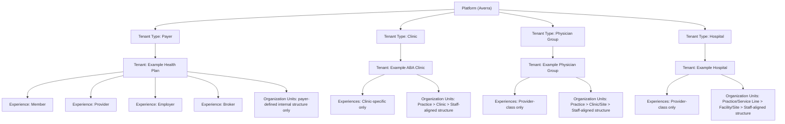

# Architecture Summary

## Executive Summary

The Platform is owned by Averra and contains all Tenants. Tenant Type is now the central architectural discriminator for tenant isolation, Experience resolution, and provider-class normalization.

The corrected core Tenant Types are:

- Payer
- Clinic
- Physician Group
- Hospital

Provider remains valid as an Experience inside a Payer Tenant. Standalone provider-style Tenants are normalized to Clinic by default unless explicit metadata later proves Physician Group or Hospital.

Employer, Broker, and Member are not Tenant Types. They may exist only as Experiences or Personas within an allowed Tenant context, most commonly within a Payer Tenant.

## Plain-Language Hierarchy

### Platform Hierarchy

- Platform: Averra
  - Tenant Type: Payer
  - Tenant Type: Clinic
  - Tenant Type: Physician Group
  - Tenant Type: Hospital

### Payer Hierarchy

- Platform: Averra
  - Tenant Type: Payer
    - Tenant: Example Health Plan
      - Experiences
        - Member
        - Provider
        - Employer
        - Broker
        - Admin-facing tenant capabilities as designed
      - Organization Units
        - Payer-defined internal structure only

What does not belong:

- standalone Clinic tenants under a Payer tenant
- standalone Physician Group tenants under a Payer tenant
- standalone Hospital tenants under a Payer tenant
- Organization Units from any other Tenant

### Clinic Hierarchy

- Platform: Averra
  - Tenant Type: Clinic
    - Tenant: Example ABA Clinic
      - Organization Units
        - Practice
        - Clinic
        - Staff-aligned structure
      - Experiences
        - Clinic-specific experiences only

What does not belong:

- Payer Member Experience
- Payer Employer Experience
- Payer Broker Experience
- Payer-owned data or branding

### Physician Group Hierarchy

- Platform: Averra
  - Tenant Type: Physician Group
    - Tenant: Example Physician Group
      - Organization Units
        - Practice
        - Clinic / Site
        - Staff-aligned structure
      - Experiences
        - Provider-class experiences only

What does not belong:

- Payer-owned provider state
- Hospital tenant data
- any cross-Tenant Organization Units

### Hospital Hierarchy

- Platform: Averra
  - Tenant Type: Hospital
    - Tenant: Example Hospital
      - Organization Units
        - Practice / Service Line
        - Facility / Site
        - Staff-aligned structure
      - Experiences
        - Provider-class experiences only

What does not belong:

- Payer-owned Member / Employer / Broker experiences
- Clinic tenant data
- Physician Group tenant data

## Mermaid Diagram

## Experiences By Tenant Type

### Payer

- Experiences that belong:
  - Member
  - Provider
  - Employer
  - Broker
  - Admin-facing tenant capabilities as designed
- Important note:
  - Provider here is an Experience inside the Payer Tenant, not a standalone Tenant Type.

### Clinic

- Experiences that belong:
  - Clinic-specific experiences only

### Physician Group

- Experiences that belong:
  - Provider-class experiences only

### Hospital

- Experiences that belong:
  - Provider-class experiences only

## Organization Unit Patterns By Tenant Type

### Payer

- Payer-defined internal structure only
- Never shared with Clinic, Physician Group, or Hospital tenants

### Clinic

- Practice
- Clinic
- Staff-aligned structure

### Physician Group

- Practice
- Clinic / Site
- Staff-aligned structure

### Hospital

- Practice / Service Line
- Facility / Site
- Staff-aligned structure

## Migration Notes

- Legacy standalone `PROVIDER` Tenants are normalized to `CLINIC`.
- Existing Payer Tenants remain `PAYER`.
- Legacy `EMPLOYER`, `BROKER`, and `MEMBER` Tenants are normalized to `PAYER`.
- Provider as a Payer Experience remains inside the Payer Tenant.
- Role and session resolution are compatibility-aware during the transition so older provider-role assignments continue to resolve without opening cross-Tenant access.

## Isolation Principles

- Tenant identity resolves before Experience or Capability resolution.
- Search is Tenant-scoped by default.
- Reporting is Tenant-scoped by default.
- Organization Unit queries are Tenant-scoped by default.
- Navigation is built from tenant-scoped Experience and Capability visibility.
- Branding, configuration, and session state remain Tenant-scoped.
- No cross-Tenant leakage is allowed for:
  - data
  - branding
  - tenant names
  - users
  - search
  - reporting
  - Organization Units
  - cache/session state
  - audit/event metadata
