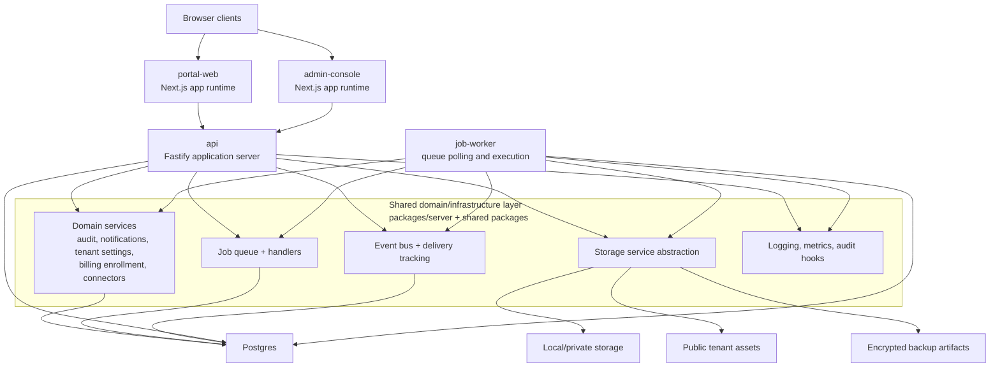
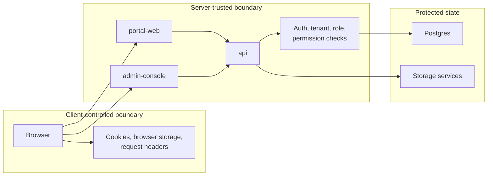
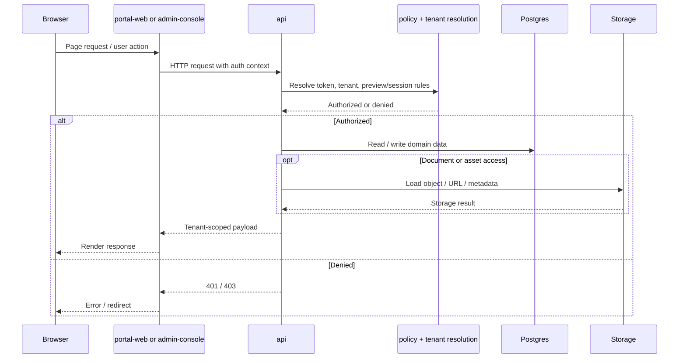
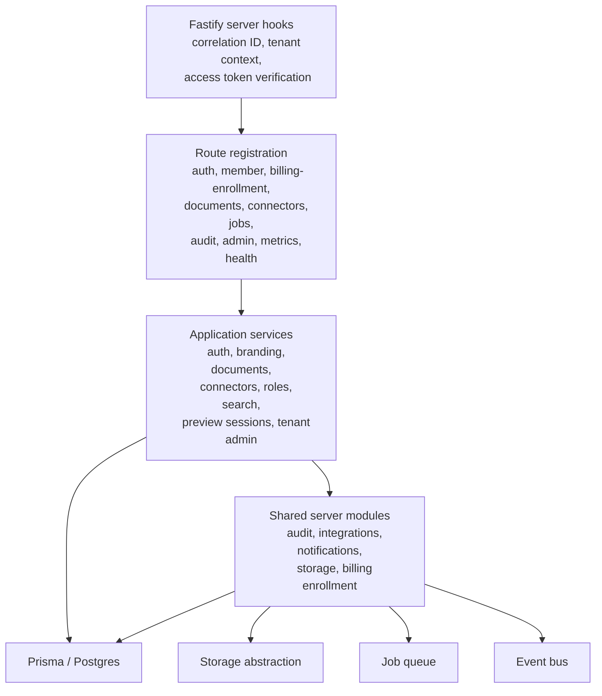
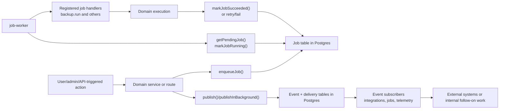
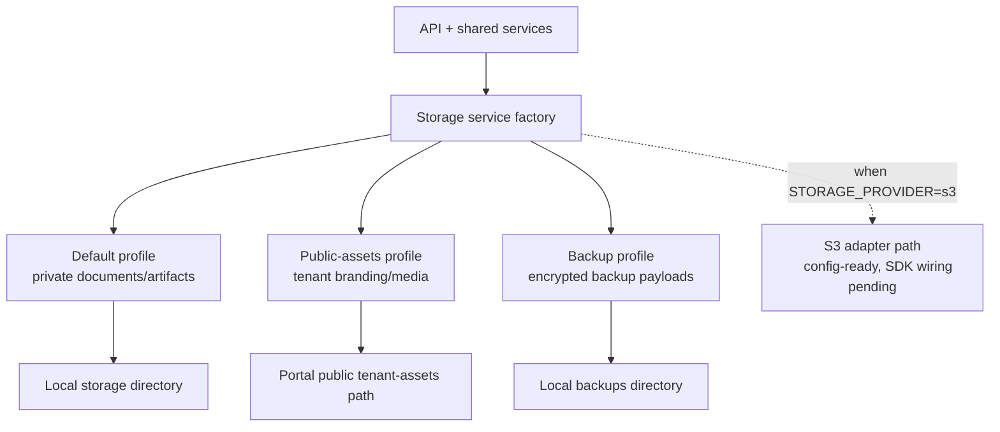
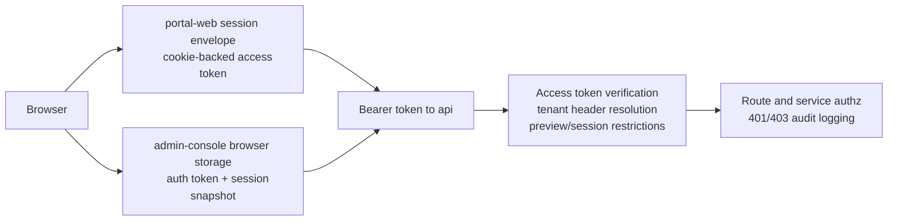
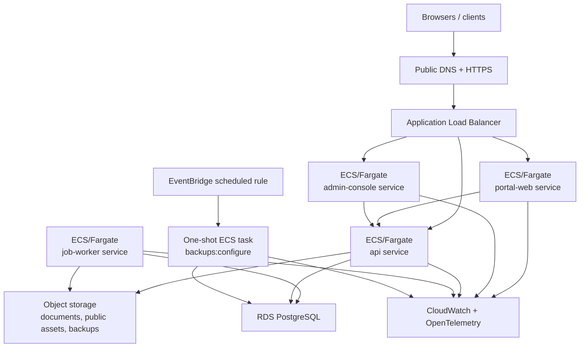
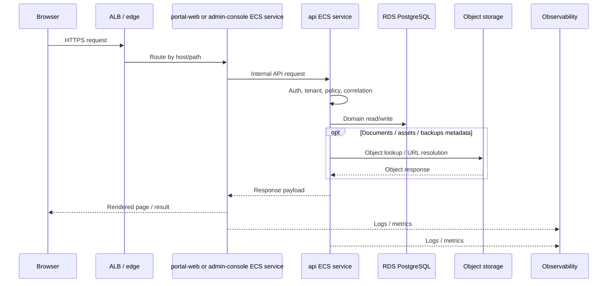
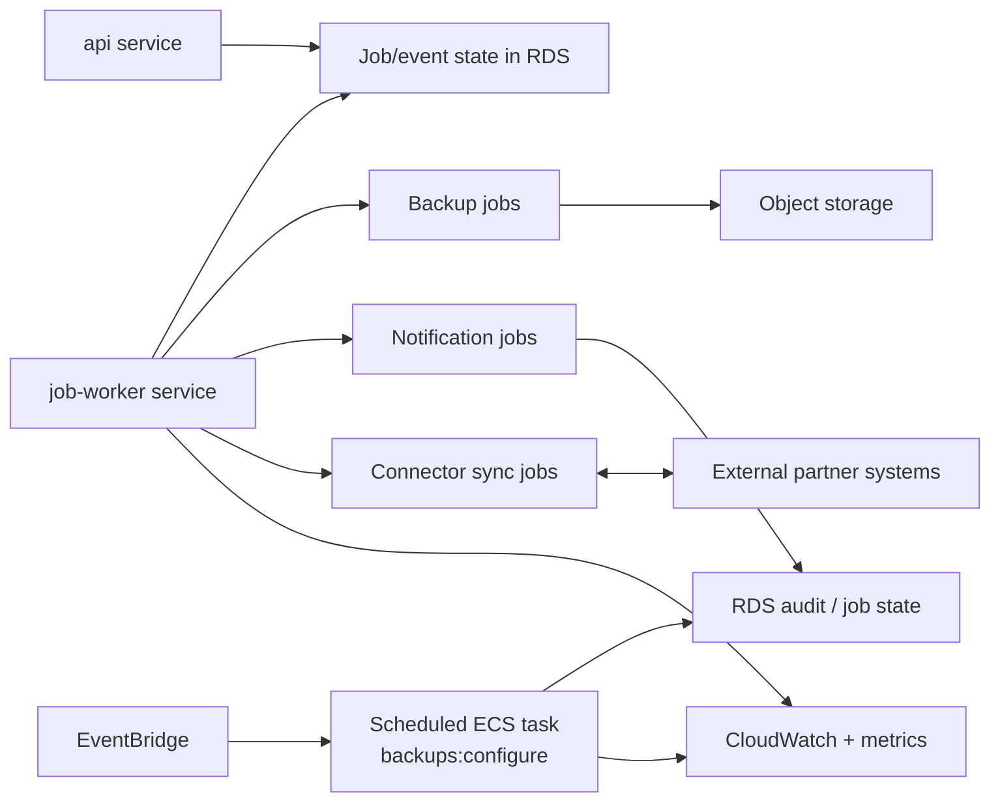

# Engineering Architecture Pack

This document is the engineering-focused companion to the executive architecture pack. It goes deeper on:

- runtime boundaries
- trust boundaries
- request paths
- async processing
- storage and data responsibilities
- deployment topology
- migration-relevant deltas between current state and the documented AWS target state

It is intended for engineering, platform, DevOps, security, and architecture review discussions.

## 1. Engineering Summary

- The platform is a modular monolith at the repository level, but it already has meaningful runtime separation across `portal-web`, `admin-console`, `api`, and `job-worker`.
- `api` is the synchronous control point for business operations, policy enforcement, and tenant-scoped data access.
- `job-worker` is the only long-running process that executes queued background work.
- Postgres is both the operational system of record and the persistence layer for jobs, event deliveries, audit data, connector state, and tenant configuration.
- Storage is abstracted behind profile-based services for private documents, public tenant assets, and encrypted backups.
- The AWS target state preserves these boundaries and mainly changes the hosting, storage, scheduling, and observability model.

## 2. Current-State Runtime Topology

## 3. Current-State Request And Trust Boundaries

## 4. Current-State Synchronous Request Path

## 5. Current-State API Internal Structure

## 6. Current-State Async, Event, And Job Processing

## 7. Current-State Storage Architecture

## 8. Current-State Security And Identity Notes

Engineering note:

- The repo contains a target security redesign that moves toward a more fully server-trusted session model and stricter tenant isolation. Use [multitenant-security-login-architecture.md](/Users/jfrank/Projects/Modular%20portal/docs/multitenant-security-login-architecture.md) as the reference for that hardening direction.

## 9. Target AWS Runtime Topology

## 10. Target AWS Request Path

## 11. Target AWS Async And Scheduled Processing

## 12. Current-State To AWS Delta Matrix

| Area | Current State | Target AWS State | Engineering Impact |
| --- | --- | --- | --- |
| Web runtimes | locally split app processes and container-ready services | ECS/Fargate services | deployment and scaling change, application boundary stays the same |
| API | Fastify app with shared server modules | ECS/Fargate API service | same app model, cloud runtime hardening |
| Worker | dedicated process polling Postgres-backed queue | ECS/Fargate worker service | same execution model, improved runtime isolation |
| Database | Postgres local/container model | RDS PostgreSQL | managed ops, backups, availability, networking changes |
| File storage | local directories via storage abstraction | object storage via storage abstraction | adapter migration and path/public URL validation |
| Scheduling | shell/manual or local task model | EventBridge-triggered ECS task | externalized scheduling control plane |
| Observability | structured logs + metrics endpoint | CloudWatch + OpenTelemetry baseline | sink/export and alarm/dashboard work |
| Runtime config | env-driven shared config | env/secrets-driven shared config in ECS | secret management and environment parity work |

## 13. Engineering Review Checklist

- Validate that all synchronous business mutations still traverse `api` after migration.
- Keep `job-worker` as the only long-running job executor.
- Preserve tenant-scoped query enforcement and avoid client-trusted tenant identity.
- Confirm storage profile mapping for documents, public assets, and backups.
- Verify backup scheduling remains external to long-running services.
- Ensure staging mirrors production service split closely enough to validate behavior.
- Confirm log correlation and metrics visibility across `portal-web`, `admin-console`, `api`, `job-worker`, and scheduled tasks.

## 14. Recommended Companion Docs

- [system-and-flow-architecture-pack.md](/Users/jfrank/Projects/Modular%20portal/docs/architecture/system-and-flow-architecture-pack.md)
- [executive-architecture-deck-outline.md](/Users/jfrank/Projects/Modular%20portal/docs/architecture/executive-architecture-deck-outline.md)
- [runtime-config-model.md](/Users/jfrank/Projects/Modular%20portal/docs/architecture/runtime-config-model.md)
- [observability-baseline.md](/Users/jfrank/Projects/Modular%20portal/docs/architecture/observability-baseline.md)
- [multitenant-security-login-architecture.md](/Users/jfrank/Projects/Modular%20portal/docs/multitenant-security-login-architecture.md)
