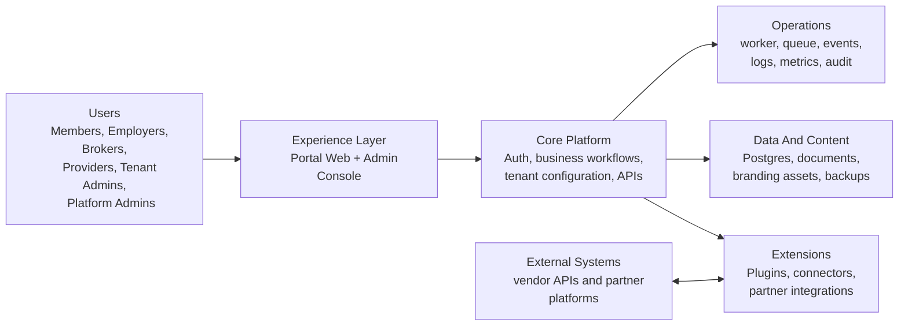
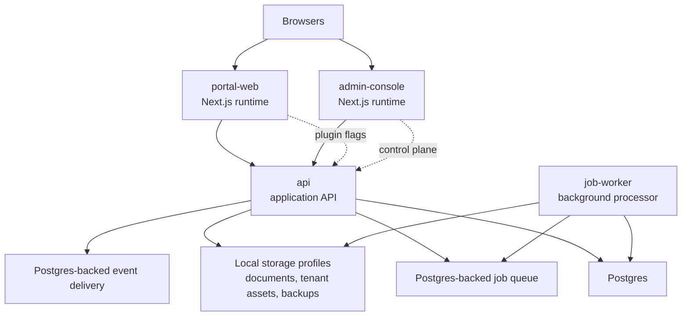
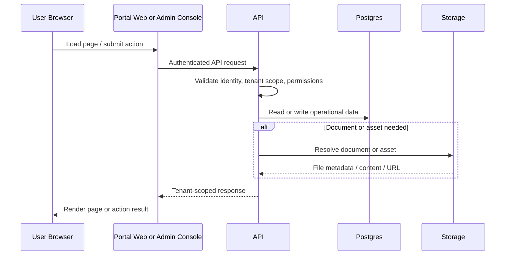
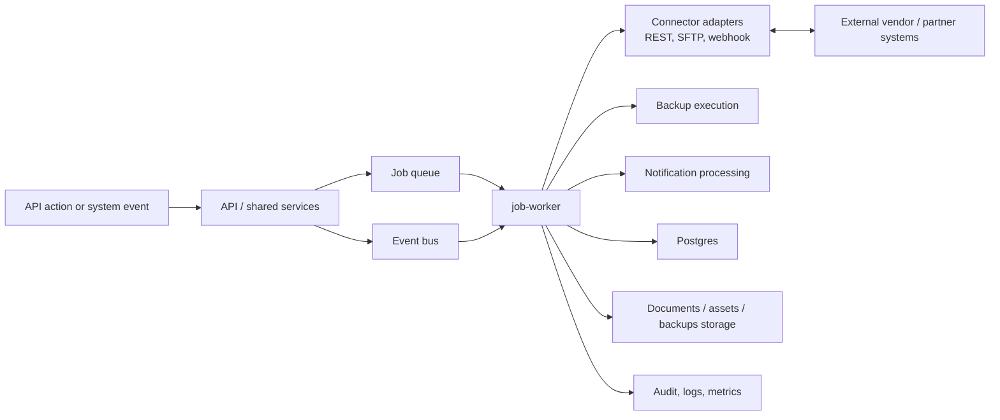
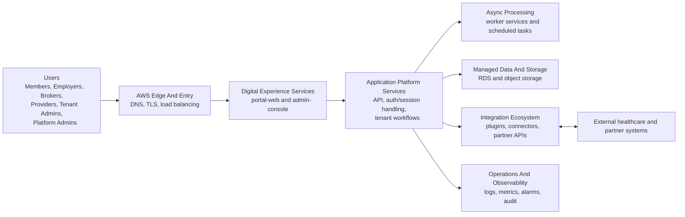
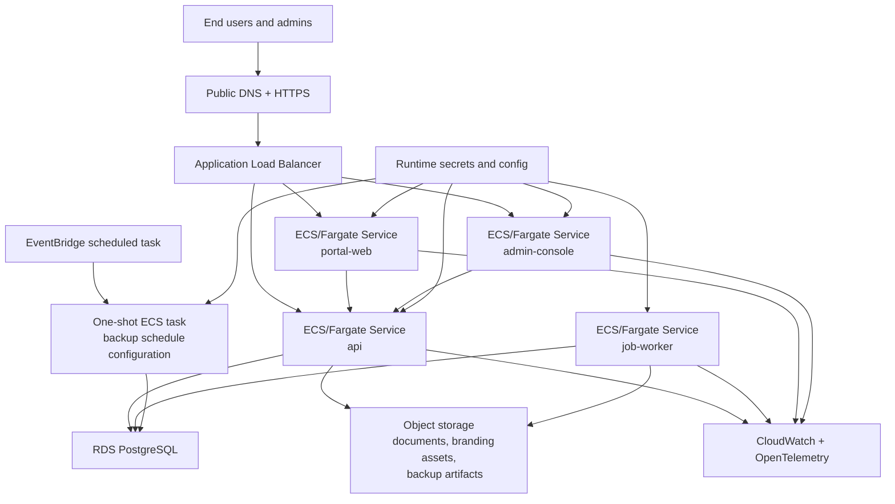
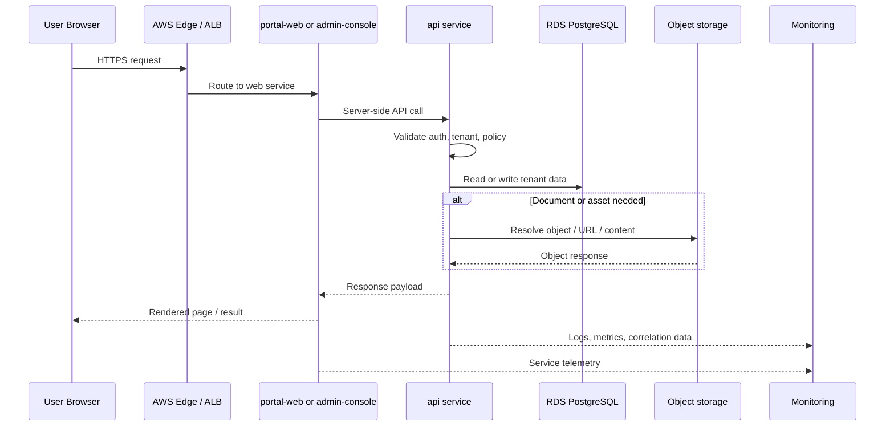
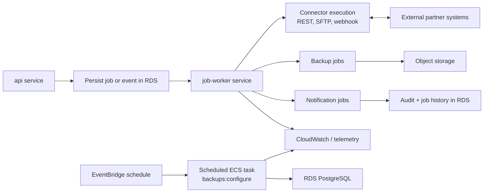
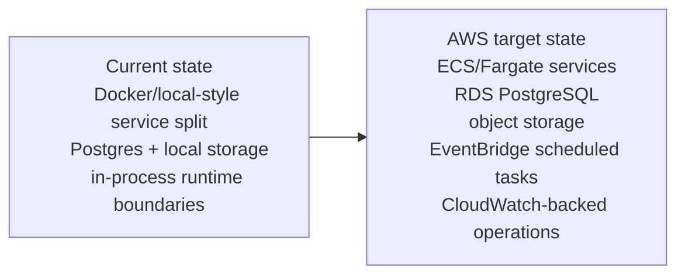

# System And Flow Architecture Pack

This document collects the high-level diagrams needed to describe the platform in two modes:

- current state
- target AWS end state

The goal is to cover both system architecture and the most important runtime flows without dropping into package-level implementation detail.

## Scope And Assumptions

- Current state is based on the monorepo runtime model, Docker Compose layout, shared server modules, and existing portal/admin/API/worker boundaries.
- Target AWS state is based on documented intended infrastructure: ECS/Fargate services for `portal-web`, `admin-console`, `api`, and `job-worker`; RDS PostgreSQL; object storage for documents and assets; EventBridge-triggered scheduled ECS tasks; and CloudWatch/OpenTelemetry for observability.
- Where the exact AWS service is not explicitly committed in the repo, the diagram stays generic rather than inventing an unsupported component.

## 1. Current-State System Context

## 2. Current-State Runtime / Deployment View

## 3. Current-State Synchronous Request Flow

## 4. Current-State Async / Integration Flow

## 5. Target AWS End-State System Context

## 6. Target AWS End-State Deployment View

## 7. Target AWS End-State Synchronous Request Flow

## 8. Target AWS End-State Async And Scheduled Flow

## 9. Migration Delta View

## 10. Diagram Usage Guide

- Use Diagram 1 for executive overviews of the current platform.
- Use Diagram 2 when discussing current runtime boundaries and deployment responsibilities.
- Use Diagram 3 for normal user and admin request lifecycle conversations.
- Use Diagram 4 for queue, connector, backup, and notification discussions.
- Use Diagram 5 for target-state architecture reviews and migration planning.
- Use Diagram 6 for AWS environment design, infra planning, and security reviews.
- Use Diagram 7 for explaining the post-migration request path end to end.
- Use Diagram 8 for operations, scheduling, and integration-runbook discussions.
- Use Diagram 9 for roadmap, funding, or migration-sequencing conversations.

## Source References

- [README.md](/Users/jfrank/Projects/Modular%20portal/README.md)
- [docs/architecture/runtime-config-model.md](/Users/jfrank/Projects/Modular%20portal/docs/architecture/runtime-config-model.md)
- [docs/architecture/observability-baseline.md](/Users/jfrank/Projects/Modular%20portal/docs/architecture/observability-baseline.md)
- [docs/architecture/system-architecture-overview.md](/Users/jfrank/Projects/Modular%20portal/docs/architecture/system-architecture-overview.md)
- [infra/README.md](/Users/jfrank/Projects/Modular%20portal/infra/README.md)
- [infra/docs/service-model.md](/Users/jfrank/Projects/Modular%20portal/infra/docs/service-model.md)
- [infra/terraform/environments/staging/README.md](/Users/jfrank/Projects/Modular%20portal/infra/terraform/environments/staging/README.md)
- [infra/terraform/environments/production/README.md](/Users/jfrank/Projects/Modular%20portal/infra/terraform/environments/production/README.md)
- [packages/server/README.backups.md](/Users/jfrank/Projects/Modular%20portal/packages/server/README.backups.md)
