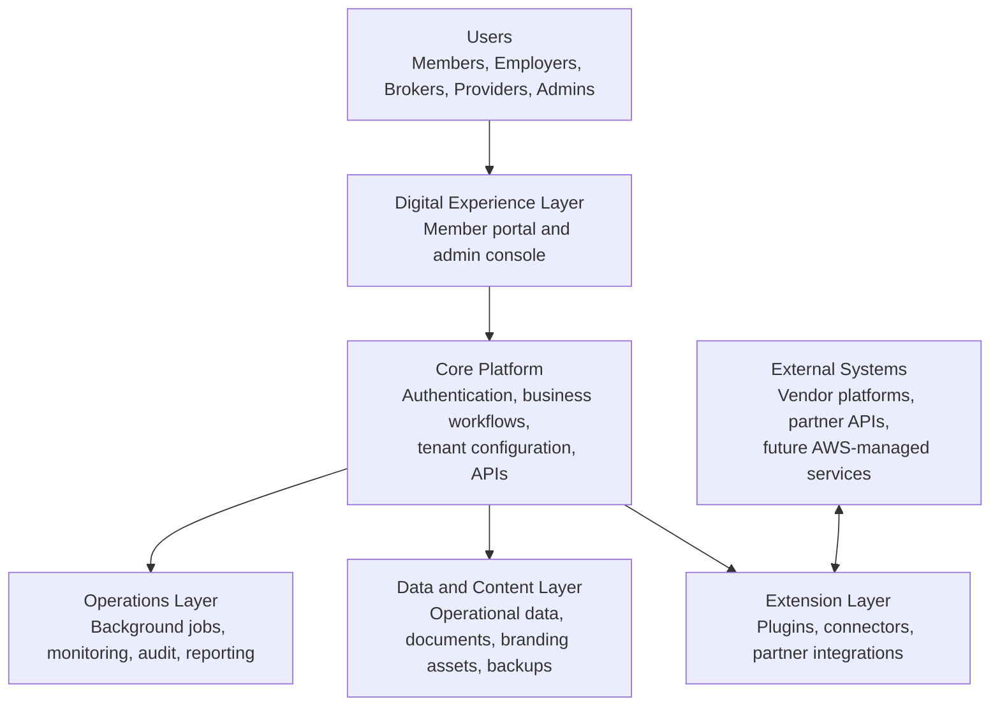
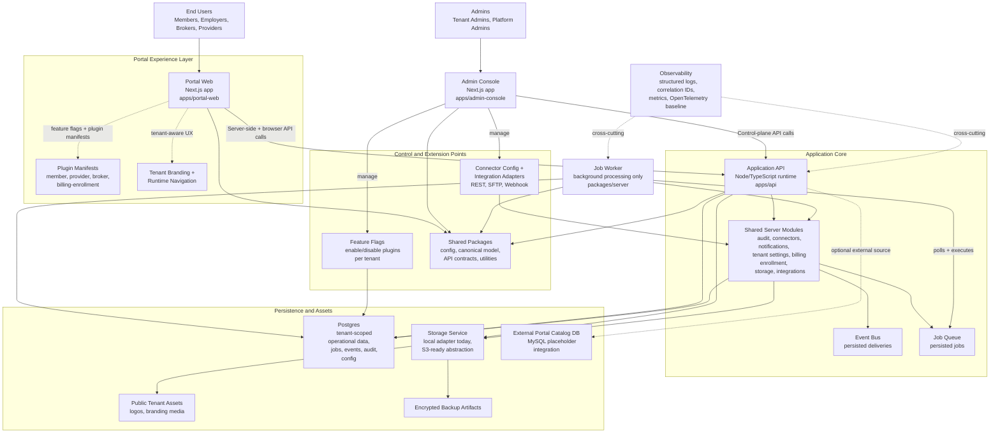

# System Architecture Overview

This diagram shows the current high-level architecture for the Modular Portal monorepo as implemented today: separate web runtimes for member-facing and admin experiences, a shared application API, a plugin-driven portal shell, shared server modules, background jobs, and tenant-scoped data/storage.

## Executive-Level Diagram

## System Diagram

## Component Summary

- `apps/portal-web`: member and channel-facing portal shell, with navigation and experiences assembled from plugin manifests and tenant feature flags.
- `apps/admin-console`: tenant-admin and platform-admin control plane for configuration, operations, cataloging, and feature enablement.
- `apps/api`: the main authenticated application API and orchestration layer used by both web apps.
- `packages/server`: shared domain and infrastructure modules for jobs, events, integrations, storage, backups, auditing, notifications, and billing/enrollment services.
- `plugins/*`: modular route and navigation manifests that let the portal surface tenant-enabled capabilities without hard-coding every workspace into the shell.
- `Postgres`: primary system of record for tenant-scoped platform data, operational records, queue state, and audit history.
- `Storage`: abstraction for documents, public tenant assets, and encrypted backups; local storage is active today and S3 is the target-compatible path.
- `job-worker`: the only long-running process that executes queued background work.

## Architectural Characteristics

- Modular monolith at the codebase level, with runtime separation between web apps, API, and worker.
- Plugin-driven portal composition controlled by feature flags and tenant context.
- Shared server-domain layer reused by API and worker rather than splitting into many microservices.
- Tenant-aware data, branding, and admin operations designed around a multitenant platform model.
- Event- and job-backed async processing for integrations, notifications, and backups.
- AWS-ready deployment direction without requiring Kubernetes.

## When To Use Which Diagram

- Use the executive-level diagram for stakeholder decks, roadmap conversations, and high-level architecture reviews.
- Use the system diagram for engineering discussions about runtime boundaries, extension points, and operational responsibilities.
